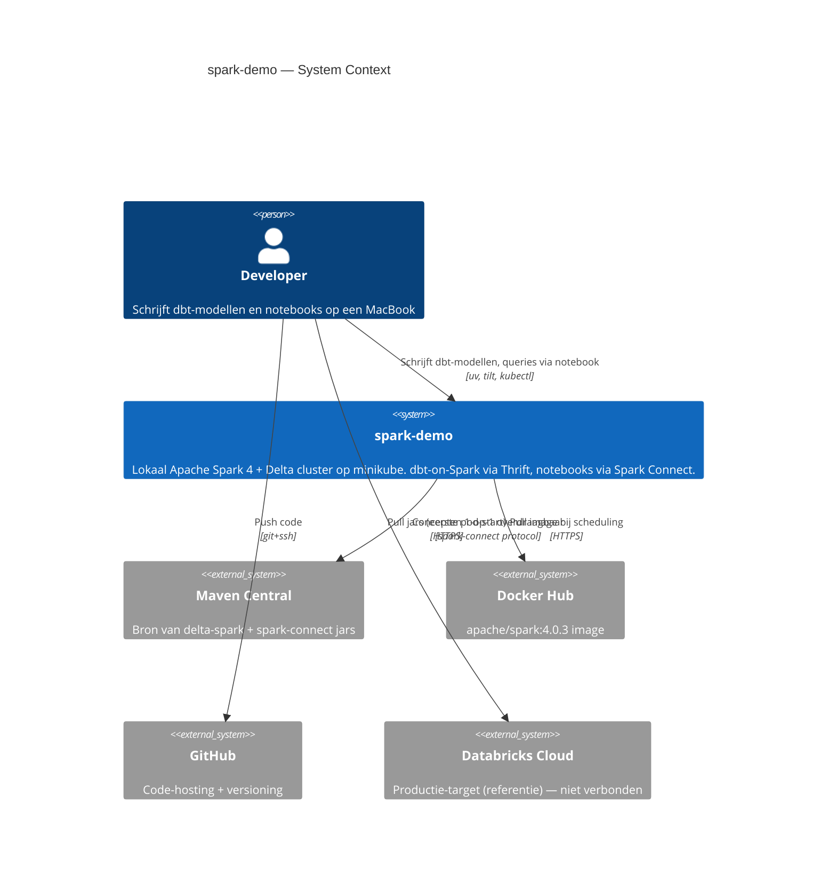
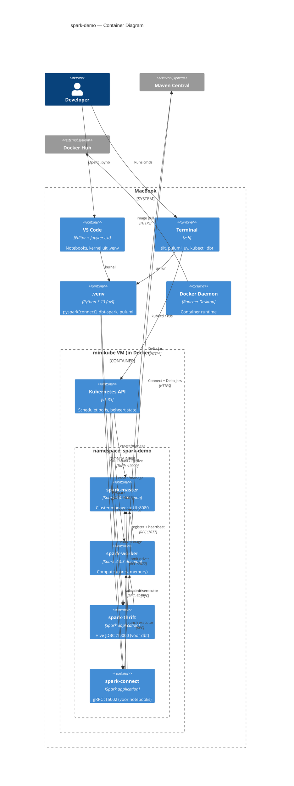
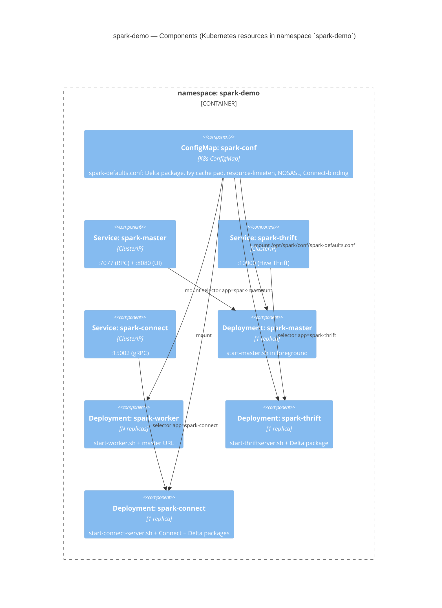

# Architectuur (C4-model)

Drie zoom-niveaus volgens [C4](https://c4model.com): context, container en component. Mermaid-blokken renderen op GitHub.

## Level 1 — System Context

Wie/wat raakt `spark-demo` aan?

**Wat dit zegt:** `spark-demo` staat lokaal op je laptop, leunt op publieke registries voor zijn dependencies en is bewust **niet** verbonden met Databricks Cloud — de waarde zit erin dat het *concept*-niveau identiek is.

## Level 2 — Container

Wat draait er, en in welke runtime?

**Wat dit zegt:**
- Op de laptop draaien tools (terminal, VS Code) en één gedeelde Python-venv.
- De `.venv` is de client-side voor zowel notebooks (via Spark Connect) als dbt (via Thrift).
- In minikube draaien vier Spark-onderdelen die elk met de master praten.
- Workers krijgen taken via spark-submit van Thrift en Connect.
- Maven en Docker Hub zijn de enige externe afhankelijkheden bij opstart.

## Level 3 — Component (Pulumi-managed K8s resources)

Wat Pulumi precies in de cluster zet:

**Wat dit zegt:**
- Eén ConfigMap (`spark-conf`) die door alle vier Deployments wordt gemount.
- Drie Services exposen poorten naar de port-forward-keten.
- Worker heeft geen eigen Service (workers worden via de master gevonden).
- Alle vier Deployments delen hetzelfde `apache/spark:4.0.3` image; verschil zit alleen in `command` + `args`.

## Wat NIET in een C4 zit (maar wel het noemen waard)

- **Tilt** zelf is geen component in de cluster — het is een orchestratie-tool op de laptop die `pulumi up` aanroept, K8s-resources observeert en port-forwards opzet. Conceptueel zit hij naast "Terminal" in Level 2.
- **uv** is een dependency-manager voor de venv, niet een service.
- **Pulumi state** leeft in `~/.pulumi/` lokaal (geen externe backend).
